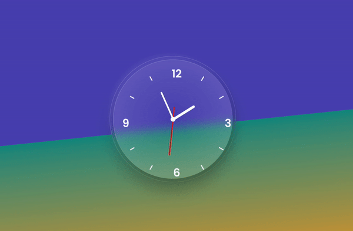

This is a functional clock with glassmorphic JavaScript clock. 

Glassmorphism has a few defining characteristics: 

- Transparency (frosted-glass effect using a Background Blur)
- Multi-layered approach with objects floating in space
- Vivid colors to highlight the blurred transparency
- A subtle, light border on the translucent objects.

That verticality and the fact you can see through it, means users can establish hierarchy and depth of the interface. They simply see which layer is on top of which, just like pieces of virtual glass.

Largely this app was made with HTML and more so CSS in order to get the clock to have that glassmorphic appearance. I used a linear gradient with 2 major colours and blurred the area behind the clock face with backdrop-filter: blur().

There was a few opportunities to practice the CSS::before selector, which I hadn't used much before. It is a pseudo-element selector that can be used in order to style CSS without adding any more HTML markup. The amazing Fireship has done a great video about these kinds of selectors [here](https://www.youtube.com/watch?v=e1KpKBHJOrA&ab_channel=Fireship)

Please check out the clock [here!](https://zenidith.github.io/clock-app/)

Happy coding!

